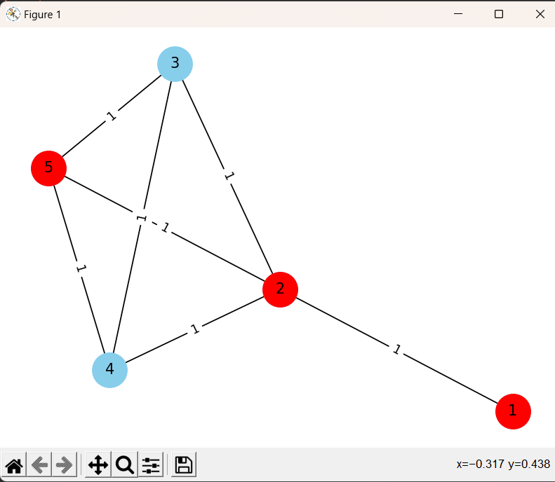

# Задача о кратчайшем пути и её решение методом динамического программирования
Репозиторий курсовой работы по предмету **"Алгоритмы дискретной математики"** . Выполнен студентами группы БПМ-22-1 НИТУ МИСИС.

## Содержание
- [Цель](#цель)
- [Задачи](#задачи)
- [Технологии](#технологии)
- [Описание](#тестирование)
- [Команда](#contributing)
- [Документация](#документация)

## Цель
Исследование методов решения задачи о кратчайшем пути в ориентированных и неориентированных графах

## Задачи
- Создание инструментов работы с графами 
- Исследование и дальнейшая реализация методов поиска пути в графах
- Создание интерфейса, понятного пользователю 
- Визуализация работы программы
- Тестирование эффективности алгоритмов

## Технологии
- [NetworkX](https://networkx.org/)
- [Matplotlib](https://matplotlib.org/stable/)

## Описание
Программа создает граф, использует различные методы поиска кратчайшего пут, визуализирует работу алгоритмов
Работает в двух режимах:
1. **Создания графа в ручном режиме**
2. **Генерация рандомного графа**

## Пример визуализации работы алгоритма 

## Интерфейс 

## To do
- [x] Распределены роли в проекте
- [x] Продумана концепция работы программы
- [x] Создание графа в различных режимах
- [x] Встроены алгоритмы Дейкстры и алгоритм Форда-Беллмана (динамическое программирование)
- [ ] Создание GUI в процессе
- [ ] Тестирование в процессе
- [ ] Написание отчета в процессе

## Команда проекта

- [Труфманов Михаил](https://github.com/Mihail20052005) — работа с графами и алгоритмами, визуализация
- [Каневский Даниил](https://github.com/danyatalent) - тимлид  
- [Махров Матвей](https://github.com/MatveyMakhrov) - написание отчета
- [Нургалиев Родион]() - тестирование программы
- [Абрамов Иван]() - разработка GUI
